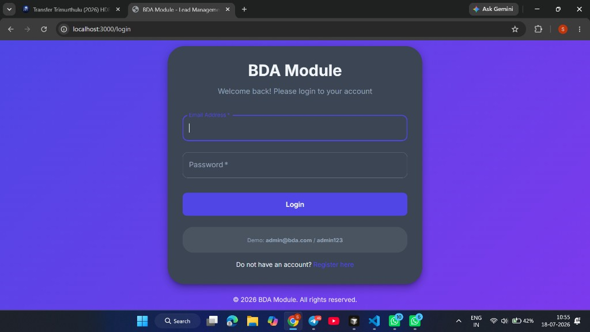
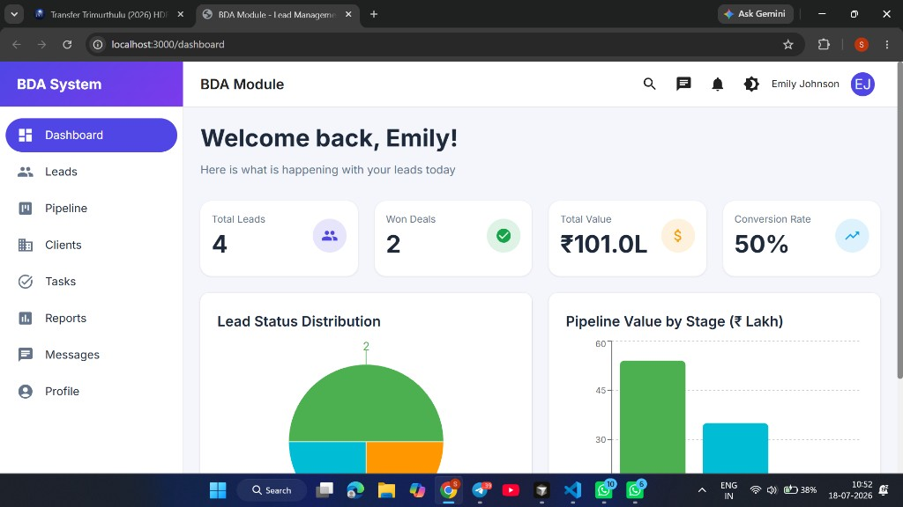
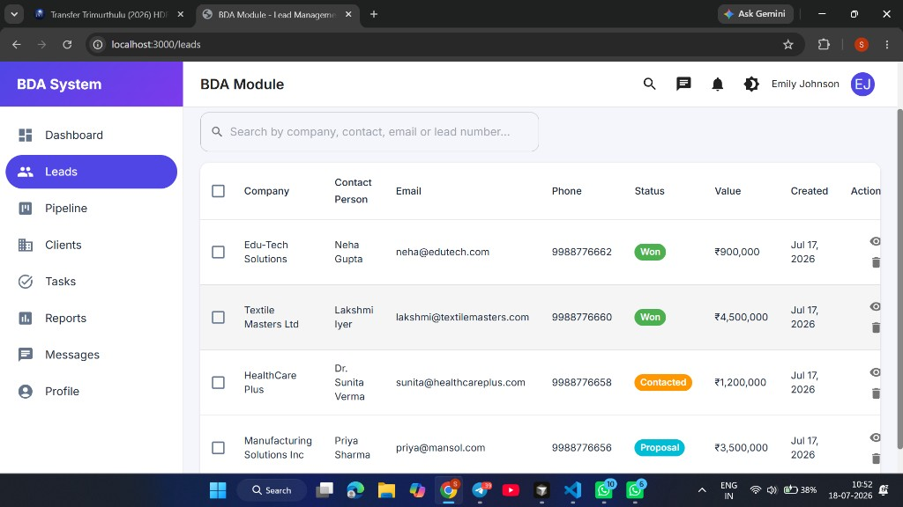
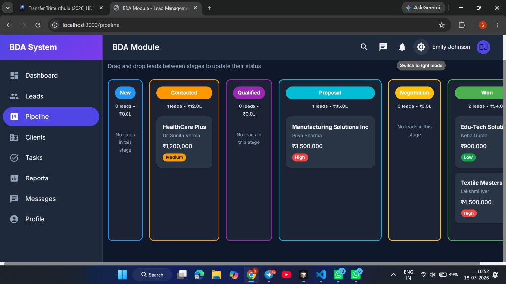
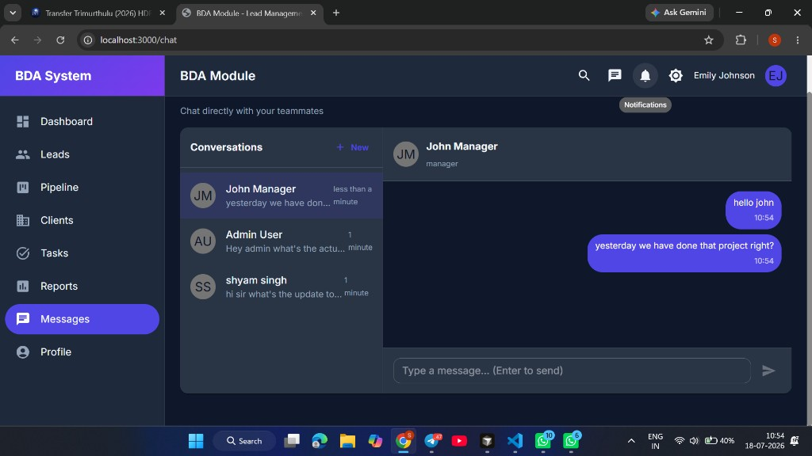

# BDA Team Module for a Manufacturing Company

A MERN Stack Business Development Associate (BDA) team management system for manufacturing companies. The application helps a sales/business development team capture leads, track opportunities through a sales pipeline, manage role-based access, record activities, and monitor performance metrics from a central dashboard.

This project was built for the MERN Stack Developer Intern technical assessment under the "Business Development Associate (BDA) Team Module for a Manufacturing Company" option.

## Screenshots

### Login



### Dashboard



### Leads



### Pipeline



### Messages (Team Chat)



## What's New in v2.0 (Pro Edition)

- **Full TypeScript migration** across both the backend (`server/src/**/*.ts`) and frontend (`client/src/**/*.tsx`) for end-to-end type safety.
- **Modern dependency stack**: Express 5, Mongoose 8, React 19, Redux Toolkit 2, MUI 7, Vite 6, Socket.io 4.
- **Redesigned, polished UI/UX** with a refreshed theme, gradient sidebar, and a **light/dark mode toggle** persisted across sessions.
- **Interactive analytics dashboard** with pie and bar charts (Recharts) for lead status distribution and pipeline value.
- **Clients module** — convert won leads into clients, list/detail, revenue stats.
- **Team Messages (1:1 chat)** — real-time DMs between teammates via Socket.io + REST, unread badges, notifications.
- **My Tasks** — follow-ups/today/overdue/upcoming views with complete action.
- **Reports & Analytics** — funnel by status/source, monthly trends, BDA leaderboard.
- **In-app notifications** — navbar bell with unread count and mark-as-read.
- **Global command-palette search** — `Ctrl/⌘ + K` across leads and clients.
- **Lead search, CSV export, CSV import, and bulk actions** (status / delete) on the Leads screen.
- **Optional integrations** (config-gated): SMTP email, OpenAI assist (draft/summarize), Twilio WhatsApp/SMS.
- **Type-safe environment configuration** validated at startup with Zod (backend).
- **Vitest** test runner and **flat-config ESLint** on both apps.

## Business Purpose

Manufacturing companies often receive business opportunities from websites, referrals, trade shows, LinkedIn, email campaigns, and direct outreach. Without a structured workflow, teams can lose follow-ups, duplicate work, or miss high-value opportunities.

This system provides a company-ready CRM workflow where:

- Managers can monitor the overall sales pipeline.
- Team leads can track assigned team opportunities.
- BDAs can manage their own leads and activities.
- Leadership can view lead value, conversion rate, won deals, and stage distribution.
- Sales follow-ups are organized through lead details and activity history.

## Key Features

### Authentication and Authorization

- JWT-based login and registration.
- Access token and refresh token flow.
- Protected API routes.
- Role-based access control for company hierarchy.
- Current-user profile endpoint and profile screen.

### Role-Based User Access

| Role | Access Level |
| --- | --- |
| Super Admin | Full access across users, leads, and pipeline data |
| Manager | Company/team-wide lead visibility and management |
| Team Lead | Team-level lead visibility and assignment support |
| BDA | Own assigned leads and lead activities |
| Viewer | Read-only access for reporting and observation |

### Lead Management

- Create, read, update, and delete leads.
- Store company name, contact person, email, phone, industry, source, status, priority, estimated value, notes, and requirements.
- Auto-generated unique lead number.
- Lead scoring and win probability helpers.
- Filtering support by status, source, priority, assigned user, date range, value range, and search text.
- Pagination support for scalable lists.

### Sales Pipeline

- Visual sales pipeline organized by lead status.
- Drag-and-drop movement between pipeline stages.
- Status updates are stored through the backend API.
- Stage-wise lead count and total estimated value.
- Useful for tracking manufacturing sales opportunities from new inquiry to won deal.

### Activity Tracking

- Lead-specific activity timeline on the lead detail page.
- Log calls, emails, meetings, notes, and tasks from the UI.
- Activity status support: pending, completed, cancelled.
- Due date support for follow-up planning.

### Clients

- Convert a won lead into a client from the lead detail page.
- Client list with search, status chips, and revenue stats.
- Client detail with status and revenue management.

### Messages (Team Chat)

- 1:1 direct messages between team members.
- Conversation list with last-message preview and unread badges.
- Real-time delivery via Socket.io (JWT-authenticated).
- Messages are stored in MongoDB and persist across logins and restarts.
- Navbar chat icon with total unread count.
- In-app notification when someone messages you.

### Tasks

- **My Tasks** page with filters: All / Today / Overdue / Upcoming.
- Mark tasks complete from the UI.
- Tasks are activities with a due date assigned to you.

### Reports

- Conversion summary (total / won / lost / rate).
- Leads by status and by source charts.
- Monthly trend (last 6 months).
- BDA leaderboard by won value.

### Notifications & Search

- Navbar notification center (polls for new items).
- Global search (`Ctrl/⌘ + K`) across leads and clients.

### Dashboard and Reporting

- Total leads.
- Won deals.
- Total estimated pipeline value.
- Conversion rate.
- Lead status distribution.
- Stage-wise value summary.

### Optional Integrations (config-gated)

Set these in `server/.env` to enable. If unset, related endpoints return a clear `503` and the rest of the app still works.

| Feature | Env vars |
| --- | --- |
| Email to leads | `SMTP_HOST`, `SMTP_PORT`, `SMTP_USER`, `SMTP_PASSWORD`, `EMAIL_FROM` |
| AI draft / summarize | `OPENAI_API_KEY`, `OPENAI_MODEL` (default `gpt-4o-mini`) |
| WhatsApp / SMS | `TWILIO_ACCOUNT_SID`, `TWILIO_AUTH_TOKEN`, `TWILIO_SMS_FROM`, `TWILIO_WHATSAPP_FROM` |

### Security and Reliability

- Password hashing with bcrypt.
- Helmet security headers.
- CORS configuration.
- API rate limiting (skipped in development for smoother local testing).
- Centralized error handling.
- Request validation with express-validator.
- Winston logging.
- MongoDB schema validations and indexes.

### Sample Data

- Seeder script with realistic manufacturing/business leads.
- Predefined users for Admin, Manager, Team Lead, and BDA roles.
- Sample activities for testing dashboard and lead-detail workflows.

## Tech Stack

### Frontend

- TypeScript 5
- React 19
- Vite 6
- Redux Toolkit 2 + React Redux 9
- React Router DOM 7
- Material UI 7
- Recharts (dashboard / reports charts)
- Axios
- Socket.io Client (real-time chat)
- Notistack
- date-fns

### Backend

- TypeScript 5 (run with `tsx`, built with `tsc`)
- Node.js 20+
- Express.js 5
- MongoDB
- Mongoose 8
- Socket.io (real-time chat)
- JWT (jsonwebtoken)
- bcryptjs
- Zod (environment validation)
- express-validator
- Nodemailer (optional email)
- Winston
- Morgan
- Helmet
- CORS
- express-rate-limit
- Vitest (testing)

## Project Structure

```text
BDA-Management-System/
+-- client/
|   +-- src/
|   |   +-- components/
|   |   |   +-- common/
|   |   |   +-- layout/         # Navbar, Sidebar, Notifications, CommandPalette
|   |   +-- constants/
|   |   +-- context/            # ColorModeContext (light/dark theme)
|   |   +-- pages/
|   |   |   +-- Auth/
|   |   |   +-- Dashboard/
|   |   |   +-- Leads/
|   |   |   +-- Pipeline/
|   |   |   +-- Clients/
|   |   |   +-- Tasks/
|   |   |   +-- Reports/
|   |   |   +-- Chat/
|   |   |   +-- Profile/
|   |   +-- redux/
|   |   |   +-- slices/         # auth, leads, clients, notifications, chat
|   |   |   +-- hooks.ts
|   |   |   +-- store.ts
|   |   +-- services/           # axios client + socket.io client
|   |   +-- types/
|   |   +-- theme.ts
|   |   +-- App.tsx
|   |   +-- main.tsx
|   +-- .env.example
|   +-- package.json
|   +-- tsconfig.json
|   +-- vite.config.ts
|
+-- server/
|   +-- src/
|   |   +-- __tests__/
|   |   +-- config/             # env.ts (Zod), database.ts
|   |   +-- controllers/
|   |   +-- middlewares/
|   |   +-- models/             # User, Team, Lead, Client, Activity, Notification, Conversation, Message
|   |   +-- routes/
|   |   +-- services/           # email, ai, messaging
|   |   +-- seeders/
|   |   +-- types/
|   |   +-- utils/
|   |   +-- app.ts
|   |   +-- server.ts
|   |   +-- socket.ts           # Socket.io JWT auth + rooms
|   +-- .env.example
|   +-- package.json
|
+-- docs/
|   +-- screenshots/            # App UI screenshots used in this README
+-- README.md
+-- vercel.json
```

## Prerequisites

Install the following before running the project locally:

- Node.js 20 or higher
- npm
- MongoDB Community Server or MongoDB Atlas
- Git, for version control

Check versions:

```bash
node -v
npm -v
mongosh --version
```

## Local Setup

Run the backend and frontend in two separate terminals.

### 1. Clone or Open the Project

```bash
cd /path/to/mern
```

If this folder is not already a Git repository, initialize it before submission:

```bash
git init
git add .
git commit -m "initial commit"
```

### 2. Configure Backend Environment

```bash
cd server
cp .env.example .env
```

Update `server/.env`:

```env
NODE_ENV=development
PORT=5000

MONGODB_URI=mongodb://localhost:27017/bda-module

JWT_SECRET=replace-with-a-strong-access-token-secret
JWT_EXPIRE=15m
JWT_REFRESH_SECRET=replace-with-a-strong-refresh-token-secret
JWT_REFRESH_EXPIRE=7d

CLIENT_URL=http://localhost:3000

RATE_LIMIT_WINDOW_MS=900000
RATE_LIMIT_MAX_REQUESTS=100

# Optional — leave blank to disable
# SMTP_HOST=smtp.gmail.com
# SMTP_PORT=587
# SMTP_USER=
# SMTP_PASSWORD=
# EMAIL_FROM=
# OPENAI_API_KEY=
# OPENAI_MODEL=gpt-4o-mini
# TWILIO_ACCOUNT_SID=
# TWILIO_AUTH_TOKEN=
# TWILIO_SMS_FROM=
# TWILIO_WHATSAPP_FROM=
```

For MongoDB Atlas, replace `MONGODB_URI` with your Atlas connection string.

### 3. Install Backend Dependencies

```bash
cd server
npm install
```

### 4. Start MongoDB

If MongoDB is installed locally, make sure it is running.

macOS with Homebrew:

```bash
brew services start mongodb-community
```

Linux:

```bash
sudo systemctl start mongod
```

Verify MongoDB:

```bash
mongosh --eval "db.runCommand({ ping: 1 })"
```

### 5. Seed Sample Data

The seed command creates demo users, leads, and activities. It also clears existing user, lead, activity, and team data from the configured database, so use it only for local/demo setup.

```bash
cd server
npm run seed
```

### 6. Start Backend Server

```bash
cd server
npm run dev
```

Backend URL:

```text
http://localhost:5000
```

Health check:

```text
http://localhost:5000/api/v1/health
```

Expected response:

```json
{
  "success": true,
  "message": "API is running",
  "timestamp": "..."
}
```

### 7. Configure Frontend Environment

Open a new terminal:

```bash
cd client
cp .env.example .env
```

`client/.env` should contain:

```env
VITE_API_BASE_URL=http://localhost:5000/api/v1
```

### 8. Install Frontend Dependencies

```bash
cd client
npm install
```

### 9. Start Frontend

```bash
cd client
npm run dev
```

Frontend URL:

```text
http://localhost:3000
```

## Demo Login Credentials

After running `npm run seed` from `server/`, use these accounts (same ones shown on the login screen and used in the seeded data):

| Name | Role | Email | Password |
| --- | --- | --- | --- |
| Admin User | Super Admin | `admin@bda.com` | `admin123` |
| John Manager | Manager | `manager@bda.com` | `manager123` |
| Sarah Lead | Team Lead | `teamlead@bda.com` | `lead123` |
| Mike Smith | BDA | `mike@bda.com` | `mike123` |
| Emily Johnson | BDA | `emily@bda.com` | `emily123` |

> Tip: Log in as **Emily Johnson** (`emily@bda.com` / `emily123`) and message **John Manager** or **Admin User** from the Messages page to try the chat.

## Recommended Demo Flow

1. Start MongoDB.
2. Seed data: `cd server && npm run seed`.
3. Start backend: `cd server && npm run dev`.
4. Start frontend: `cd client && npm run dev`.
5. Open `http://localhost:3000`.
6. Login as `admin@bda.com` / `admin123`.
7. View **Dashboard** metrics and charts.
8. Open **Leads** — search, create, export CSV, try bulk status/delete.
9. Open **Pipeline** and drag a lead to another stage.
10. Open a lead detail — log an activity, convert a won lead to a **Client**.
11. Open **Messages** — start a DM with another seeded user (open a second browser/incognito and login as Emily or John to chat live).
12. Open **Tasks**, **Reports**, and the notification bell.
13. Press `Ctrl/⌘ + K` for global search.
14. Login as a BDA user to confirm role-based lead visibility.

## Available Scripts

### Backend Scripts

Run from `server/`:

| Command | Purpose |
| --- | --- |
| `npm run dev` | Start the server in watch mode with `tsx` |
| `npm run build` | Type-check and compile TypeScript to `dist/` |
| `npm start` | Run the compiled server from `dist/` |
| `npm run seed` | Seed local database with demo users, leads, and activities |
| `npm run typecheck` | Type-check without emitting output |
| `npm test` | Run the Vitest test suite |
| `npm run lint` | Run ESLint on `src/**/*.ts` |

### Frontend Scripts

Run from `client/`:

| Command | Purpose |
| --- | --- |
| `npm run dev` | Start Vite development server |
| `npm run build` | Type-check and build frontend for production |
| `npm run preview` | Preview production build locally |
| `npm run typecheck` | Type-check without emitting output |
| `npm run lint` | Run ESLint on `src/**/*.{ts,tsx}` |

## Quality Checks

Run these before submission:

```bash
# Verify folder setup and dependencies
bash verify-setup.sh

# Backend tests
cd server
npm test

# Frontend lint
cd ../client
npm run lint

# Frontend production build
npm run build
```

## API Overview

Base URL:

```text
http://localhost:5000/api/v1
```

### Authentication

| Method | Endpoint | Description |
| --- | --- | --- |
| POST | `/auth/register` | Register a new user |
| POST | `/auth/login` | Login and receive access/refresh tokens |
| POST | `/auth/refresh-token` | Generate a new access token |
| POST | `/auth/logout` | Logout current user |
| GET | `/auth/me` | Get current authenticated user |
| PUT | `/auth/update-profile` | Update profile details |
| PUT | `/auth/change-password` | Change password |

### Leads

| Method | Endpoint | Description |
| --- | --- | --- |
| GET | `/leads` | Get leads with filters and pagination |
| GET | `/leads/stats` | Get dashboard statistics |
| POST | `/leads` | Create a lead |
| POST | `/leads/bulk` | Bulk assign / status / delete |
| POST | `/leads/import` | Import leads from a JSON/CSV payload |
| GET | `/leads/:id` | Get lead details |
| PUT | `/leads/:id` | Update lead |
| DELETE | `/leads/:id` | Delete lead |
| PATCH | `/leads/:id/status` | Update lead status |
| PATCH | `/leads/:id/assign` | Assign lead to another user |
| POST | `/leads/:id/email` | Send email to lead (requires SMTP) |
| POST | `/leads/:id/message` | Send WhatsApp/SMS (requires Twilio) |

### Activities

| Method | Endpoint | Description |
| --- | --- | --- |
| GET | `/leads/:id/activities` | Get activities for a lead |
| POST | `/leads/:id/activities` | Create an activity for a lead |
| GET | `/activities/my-tasks` | My tasks (`?filter=today\|overdue\|upcoming\|all`) |
| PATCH | `/activities/:id/complete` | Mark a task completed |

### Clients

| Method | Endpoint | Description |
| --- | --- | --- |
| GET | `/clients` | List clients |
| GET | `/clients/stats` | Client summary stats |
| POST | `/clients` | Create a client |
| POST | `/clients/convert/:leadId` | Convert a lead to a client |
| GET | `/clients/:id` | Client detail |
| PUT | `/clients/:id` | Update client |
| DELETE | `/clients/:id` | Delete client |

### Chat / Messages

| Method | Endpoint | Description |
| --- | --- | --- |
| GET | `/chat/contacts` | Teammates available to message |
| GET | `/chat/conversations` | My conversations (+ unread counts) |
| POST | `/chat/conversations` | Get or create a DM (`{ userId }`) |
| GET | `/chat/conversations/:id/messages` | Message history (marks read) |
| POST | `/chat/conversations/:id/messages` | Send a message |
| PATCH | `/chat/conversations/:id/read` | Mark conversation read |
| GET | `/chat/unread` | Total unread message count |

Socket.io events (same origin as the API, auth via `handshake.auth.token`):

- Server → client: `message:new`
- Client → server: `chat:typing`

### Notifications, Search, Reports, AI

| Method | Endpoint | Description |
| --- | --- | --- |
| GET | `/notifications` | List notifications + unread count |
| PATCH | `/notifications/:id/read` | Mark one read |
| PATCH | `/notifications/read-all` | Mark all read |
| GET | `/search?q=` | Global search (leads + clients) |
| GET | `/reports/overview` | Funnel, sources, leaderboard, monthly |
| POST | `/ai/draft-email` | AI email draft (requires OpenAI) |
| POST | `/ai/summarize` | AI lead summary (requires OpenAI) |

## Data Models

### User

Stores employee/user identity, authentication details, role, team reference, department, targets, and account status.

### Lead

Stores sales opportunity details such as company information, contact person, source, status, priority, estimated value, owner, requirements, notes, scoring, probability, follow-up date, and status history.

### Activity

Stores lead interaction history such as calls, emails, meetings, notes, tasks, due dates, completion status, and outcomes.

### Team

Stores team name, team lead, members, sales targets, region, and active status.

### Client

Stores converted/won customers, including company details, account manager, revenue, contracts, billing information, and client status.

### Conversation / Message

Stores 1:1 team chats. Conversations link two participants; messages store body, sender, and `readBy`. Data lives in MongoDB and persists across logins and server restarts (as long as you keep the same `MONGODB_URI`).

### Notification

Stores in-app notifications (lead assigned, new message, system, etc.) per recipient with read/unread state.

## Lead Workflow

The sales workflow is designed around these stages:

```text
New -> Contacted -> Qualified -> Proposal -> Negotiation -> Won
```

Additional statuses supported by the backend:

```text
Lost, Nurturing
```

This allows a manufacturing company to track both active opportunities and long-term prospects.

## Security Notes

- Do not commit real `.env` files.
- Replace JWT secrets before deployment.
- Use MongoDB Atlas or a secured MongoDB server for production.
- Restrict CORS to the deployed frontend URL in production.
- Store production secrets in a secure secret manager or hosting provider environment variables.
- Use HTTPS in production.

## Production Build

Build frontend:

```bash
cd client
npm run build
```

Start backend:

```bash
cd server
npm start
```

The frontend `dist/` folder can be deployed to platforms such as Vercel, Netlify, or any static hosting service. The backend can be deployed to Render, Railway, AWS, Azure, or any Node.js hosting environment.

## Troubleshooting

### Backend cannot connect to MongoDB

- Confirm MongoDB is running.
- Confirm `MONGODB_URI` in `server/.env`.
- Try `mongosh --eval "db.runCommand({ ping: 1 })"`.

### Frontend cannot reach backend

- Confirm backend is running on `http://localhost:5000`.
- Confirm `client/.env` has `VITE_API_BASE_URL=http://localhost:5000/api/v1`.
- Restart the frontend after changing `.env`.

### Login fails after setup

- Run `npm run seed` from `server/`.
- Use the sample credentials listed above.
- Confirm the backend terminal shows MongoDB connected.

### Messages missing after re-login / “Failed to send message”

- Confirm MongoDB is still the **same** database (`MONGODB_URI` in `server/.env`). Running `npm run seed` **wipes** users/leads/activities — chat conversations are separate, but if you wipe the DB or switch URIs, history looks “gone”.
- Confirm `socket.io` is installed: `cd server && npm install` and `cd client && npm install`.
- Confirm the backend log shows `Socket.io initialized` and `Message sent by ...` when you send.
- Hard-refresh the browser (`Ctrl+Shift+R`) after a server restart.
- Real-time chat needs a persistent Node process (e.g. local `npm run dev`, Render, Railway). Pure Vercel serverless cannot keep WebSockets open; messages still save via REST and appear on refresh.

### Port already in use

Change ports in:

- Backend: `server/.env` -> `PORT`
- Frontend: `client/vite.config.ts` -> `server.port`

## Assessment Alignment

This project satisfies the BDA module requirement by implementing:

- Lead pipeline management.
- Sales tracking.
- Client communication history through activities.
- Team-role workflow through RBAC.
- Dashboard and team performance metrics.
- MERN stack architecture.
- Clean folder structure.
- Reusable components and centralized services.
- Local setup documentation.
- Seed data for evaluation.
- Testing, linting, and production build scripts.

## Author

Saidatta Dasari
saidattad09@gmail.com

Built as part of the MERN Stack Developer Intern technical assessment.
